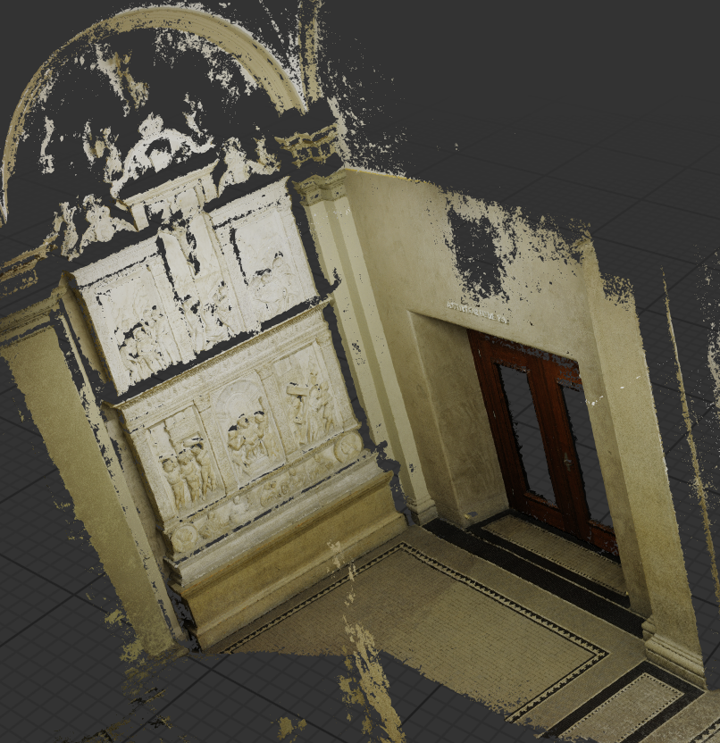
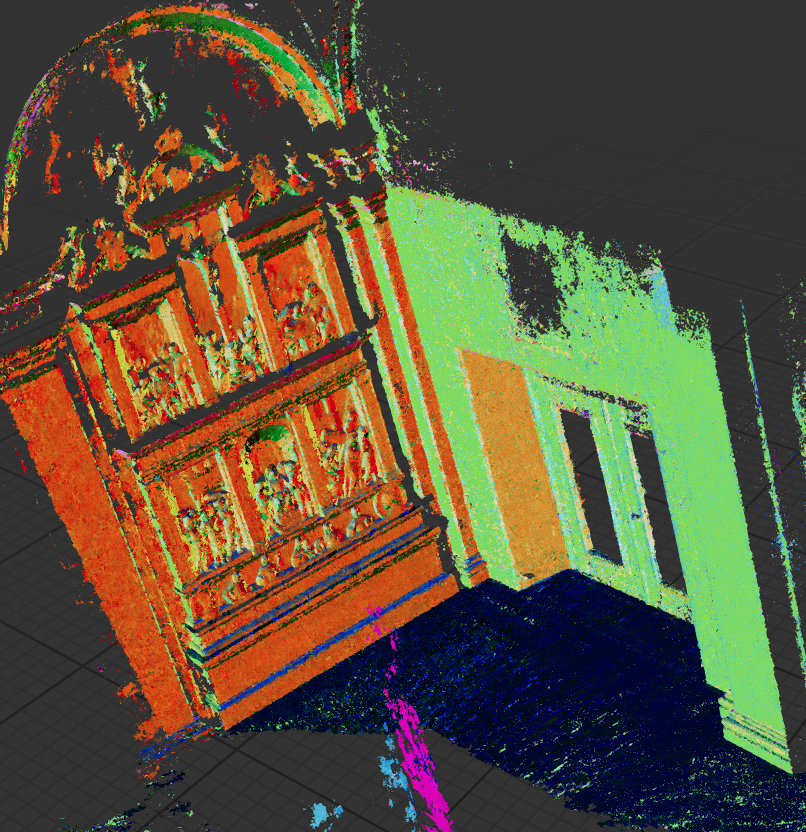

# ACMH\_Kompute
Reimplementation of [ACMH](https://github.com/GhiXu/ACMH) with the Kompute framework

Compile with CMake:
```
mkdir build
cd build
cmake ..
make
```

Use `./scripts/pipeline.sh -d path/to/dataset -e build/main` to prepare data and run ACMH in one step.
This requires [COLMAP](https://colmap.github.io/) to be installed.
The directory structure of the dataset should be the following:
```
└── dataset_root
    └── images
        ├─── img1.jpg
        ├─── img2.jpg
        ├─── img3.jpg
        ...
```
The resulting point cloud can be found as a .ply file in `${dataset_folder}/acmh_input/ACMH/ACMH_model.ply`

## Sample reconstructions:
<br>


<br>


